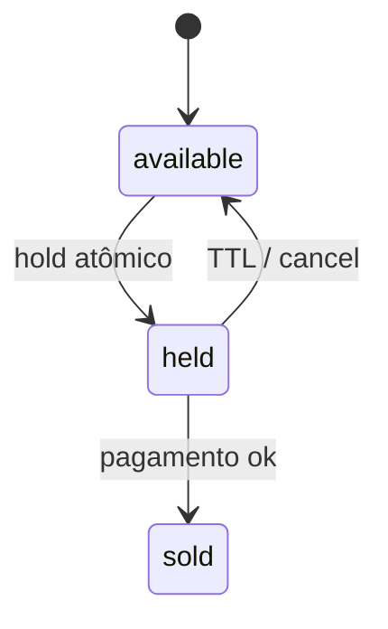

# Decisions (ADR leve)

## ADR-001 — Node/TS + Fastify + Vite

**Status:** accepted  
**Contexto:** 7 dias; músculo em Node/TS/React; vaga também pede Python, mas o PDF aceita Node.  
**Decisão:** Fastify + React/Vite + Postgres. 
**Alternativas:** FastAPI; Nest (mais cerimônia).

## ADR-002 — Hold de assento com TTL 10 minutos

**Status:** accepted  
**Contexto:** evitar double-sell e dar tempo de checkout.  
**Decisão:** `available → held (held_by, held_until) → sold`; `UPDATE … WHERE status='available'`; TTL **10 min**; front mostra countdown a partir de `held_until`. Timer UI não é fonte da verdade.  
**Consequências:** precisa liberar expirados (lazy no acesso + job leve).  
**Produção:** Redis lock, WS, filas — documentar no README.

## ADR-003 — QR não forjável via HMAC

**Status:** accepted (desenho)  
**Decisão:** código do ingresso = payload assinado (HMAC) verificável só com segredo do servidor.  
**Alternativas:** JWT curto; só UUID opaco no DB (mais frágil se vazar padrão).

## ADR-004 — TMDb como catálogo externo

**Status:** accepted  
**Decisão:** TMDb para filmes/shows em cartaz; Ticketmaster fica fora do MVP.  
**Consequências:** precisa `TMDB_API_KEY` no `.env`.

## ADR-006 — Auth JWT + refresh rotativo (como Linky)

**Status:** accepted  
**Contexto:** 3 papéis; desafio pede auth sólida; já validamos o padrão no Linky.  
**Decisão:** access JWT curto (~15 min) com claim `role`; refresh **opaco**, hash no DB, **rotação** a cada uso; reuse de refresh revogado → revoga a família; logout revoga refresh.  
**Seed:** `org@elite.local`, `cliente1@` / `cliente2@`, `portaria@elite.local`.  
**Alternativas:** só access longo (pior se vazar).

## ADR-007 — Tailwind v4, tokens da marca

**Status:** accepted  
**Contexto:** o front ia em CSS próprio para fugir de template; a decisão do desafio é Tailwind.  
**Decisão:** `@tailwindcss/vite` + paleta **Excalidraw** (`#6965db`, canvas `#f6f6f9`, ilhas brancas, fonte Assistant). Sem shadcn/MUI.  
**Alternativas:** CSS puro; tema escuro verde/dourado (rejeitado).

## ADR-008 — Sessão flat no MVP; Evento+N sessões depois

**Status:** accepted  
**Contexto:** 7 dias; org precisa publicar e vender já. Modelar Evento pai + N sessões (horários) + painel/gráficos cedo atrasa hold/checkout/portaria.  
**Decisão:** no MVP, `Event` **é** a sessão vendável (1 filme TMDb + data/hora + preço + grade). Soft-archive via `Event.status` (`PUBLISHED` | `ARCHIVED`).  
**Depois:** Evento pai (filme/show) → sessões filhas; painel do organizador; gráficos/relatórios de ocupação e receita.  
**Alternativas:** hierarquia Evento/Sessão desde o dia 1 (mais joins e UI org sem ganho no fluxo vertical).

## ADR-009 — Checkout: hold + pagamento simulado 25%

**Status:** accepted  
**Contexto:** fatias #3+#4 juntas em `feat/seat-hold`; precisa de hold atômico, demo de pagamento e ingresso com QR sem gateway real.  
**Decisão:**
- Hold: `POST /events/:id/hold` e `DELETE /events/:id/hold` (cliente; até 8 assentos; TTL 10 min no servidor).
- Checkout: `POST /events/:id/checkout` — ~25% recusa simulada no servidor (402, hold permanece); sucesso marca assentos `SOLD` e cria **1 `Ticket` por assento** (sem modelo `Order`).
- Soft archive: org arquiva sessão (`ARCHIVED`); some do catálogo público; libera `HELD`.
- QR: `code = ticketId.sig` (HMAC, ADR-003).  
**Alternativas:** Order+line items; gateway sandbox; hold só no front (rejeitado — double-sell).

## ADR-010 — Portaria: scan HMAC atômico por sessão

**Status:** accepted  
**Contexto:** fatia #5 em `feat/door`; QR já existe (ADR-003); `TicketStatus` `UNUSED`/`USED` no schema; sessão = `Event` publicado (ADR-008).  
**Decisão:**
- API: `POST /events/:id/scan` `{ code }`, `requireRole(DOOR)`.
- Sessão alvo: `Event` `PUBLISHED`; arquivada ou inexistente → **404**.
- Código vazio → **400**; org/cliente/anônimo → **401/403**.
- Sucesso **200** `{ outcome: 'valid' | 'invalid' | 'used' | 'wrong_event', seat?: { row, number } }`.
- Ordem de avaliação (não vazar existência de UUID):
  1. HMAC inválido, payload lixo ou `ticketId` inexistente → `invalid`.
  2. `eventId` do ticket ≠ `:id` da rota → `wrong_event` (mesmo se já `USED`).
  3. `USED` na sessão certa → `used`.
  4. Senão `updateMany` `UNUSED`→`USED` (atômico) → `valid` + assento.
- Web (`/door`): seletor de sessão + filtro data/título no cliente; câmera (`jsQR`) e campo manual na mesma tela; válido consome na hora; permanece na rota; pausa **2 s** e ignora o mesmo `code` repetido.
**Alternativas:** GET idempotente (rejeitado — portaria precisa marcar uso); validar só UUID no DB sem HMAC (rejeitado — ADR-003).
