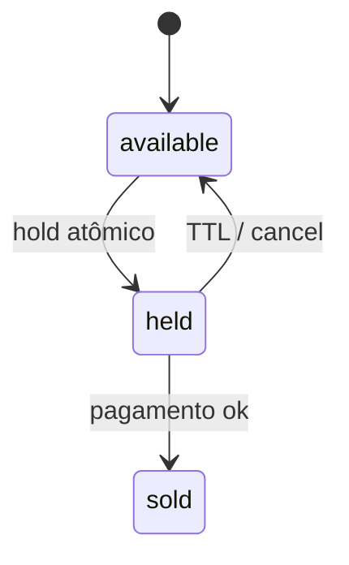

# Decisions (ADR leve)

## ADR-001 — Node/TS + Fastify + Vite

**Status:** accepted  
**Contexto:** 7 dias; músculo em Node/TS/React; vaga também pede Python, mas o PDF aceita Node.  
**Decisão:** Fastify + React/Vite + Postgres. 
**Alternativas:** FastAPI; Nest (mais cerimônia).

## ADR-002 — Hold de assento com TTL 10 minutos

**Status:** accepted  
**Contexto:** evitar double-sell e dar tempo de checkout.  
**Decisão:** `available → held (held_by, held_until) → sold`; `UPDATE … WHERE status='available'`; TTL **10 min**; front mostra countdown a partir de `held_until`. Timer UI não é fonte da verdade.  
**Consequências:** precisa liberar expirados (lazy no acesso + job leve).  
**Produção:** Redis lock, WS, filas — documentar no README.

## ADR-003 — QR não forjável via HMAC

**Status:** accepted (desenho)  
**Decisão:** código do ingresso = payload assinado (HMAC) verificável só com segredo do servidor.  
**Alternativas:** JWT curto; só UUID opaco no DB (mais frágil se vazar padrão).

## ADR-004 — TMDb como catálogo externo

**Status:** accepted  
**Decisão:** TMDb para filmes/shows em cartaz; Ticketmaster fica fora do MVP.  
**Consequências:** precisa `TMDB_API_KEY` no `.env`.

## ADR-006 — Auth JWT + refresh rotativo (como Linky)

**Status:** accepted  
**Contexto:** 3 papéis; desafio pede auth sólida; já validamos o padrão no Linky.  
**Decisão:** access JWT curto (~15 min) com claim `role`; refresh **opaco**, hash no DB, **rotação** a cada uso; reuse de refresh revogado → revoga a família; logout revoga refresh.  
**Seed:** `org@elite.local`, `cliente1@` / `cliente2@`, `portaria@elite.local`.  
**Alternativas:** só access longo (pior se vazar).

## ADR-007 — Tailwind v4, tokens da marca

**Status:** accepted  
**Contexto:** o front ia em CSS próprio para fugir de template; a decisão do desafio é Tailwind.  
**Decisão:** `@tailwindcss/vite` + paleta **Excalidraw** (`#6965db`, canvas `#f6f6f9`, ilhas brancas, fonte Assistant). Sem shadcn/MUI.  
**Alternativas:** CSS puro; tema escuro verde/dourado (rejeitado).
