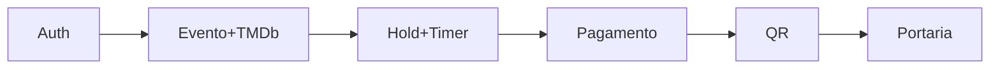

# Roadmap — Elite Eventos

Uma linha = uma entrega. **Fluxo vertical antes dos opcionais.**

| # | Fatia | Status | Done quando… |
|---|-------|--------|--------------|
| 0 | Bootstrap api+web · lint · prettier · testes health · CI · Compose | ✅ | pipeline verde local |
| 1 | Auth 3 papéis + seed users | ✅ | login organizer/customer/door |
| 2 | TMDb + criar/listar eventos (org) | ✅ | evento publicado com grade |
| 3 | Mapa assentos + hold TTL 10 min + lock atômico | ✅ | double-sell impossível — junto com #4 em `feat/seat-hold` |
| 4 | Pagamento simulado ok/recusa → ingresso + QR HMAC | ✅ | meus ingressos — junto com #3 em `feat/seat-hold` |
| 5 | Portaria: câmera + digitação · válido/inválido/usado/evento errado | ✅ | fluxo ponta a ponta — em `feat/door` |
| 6 | Link compartilhável do ingresso | ✅ | abre ingresso read-only — em `feat/ticket-share` |
| 7 | Cancelamento+estoque | ✅ | cliente devolve UNUSED futuro — em `feat/ticket-cancel`. Busca no cartaz/carteira: `feat/catalog-filters`. Painel org: fora do tempo. |
| 8 | Polling no mapa (sem WS) | ✅ | outros veem hold — ADR-014, `feat/seat-poll`. WS só produção (ADR-002). |
| 9 | Testes de domínio + README Uso de IA + deploy | ✅ | demo no Railway + Uso de IA no README. Testes nas fatias anteriores. Painel org / WS: não deu no tempo. |

